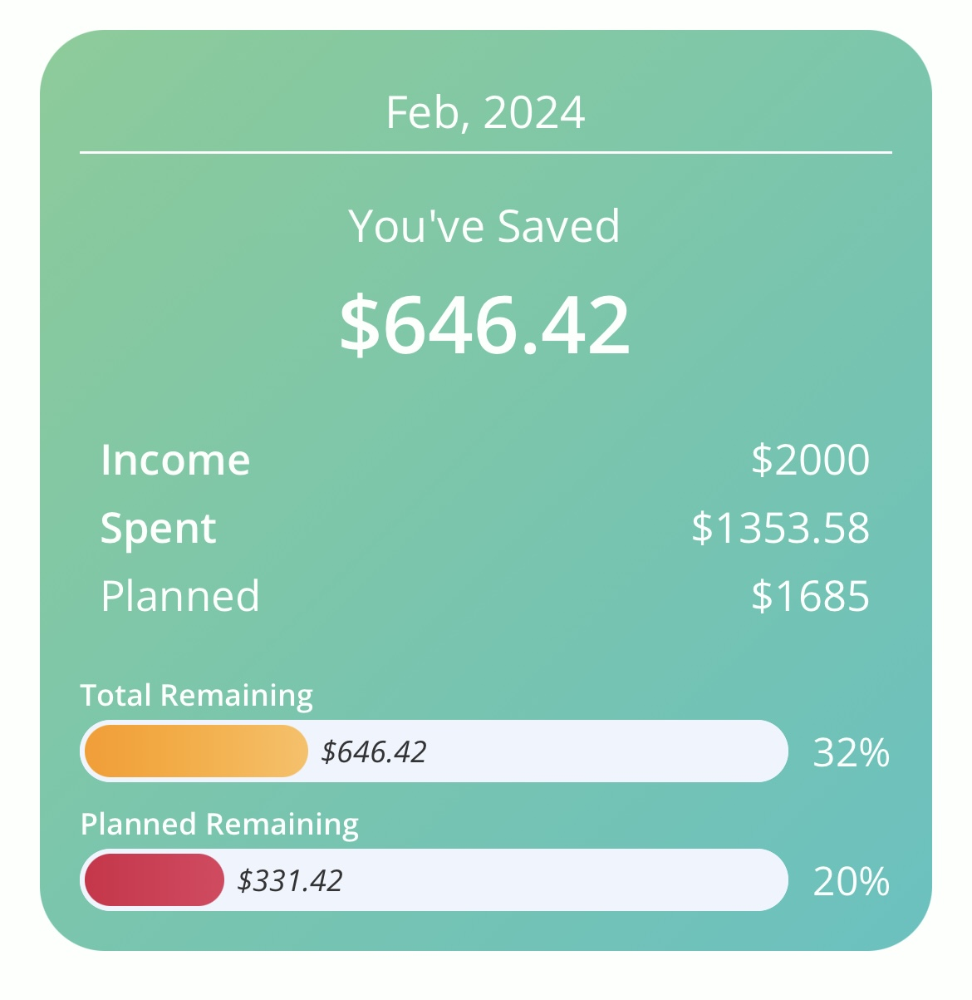
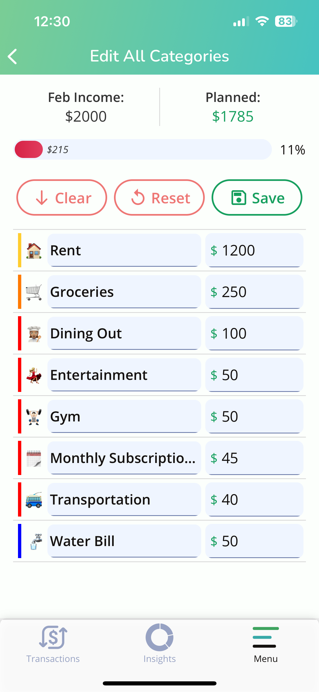
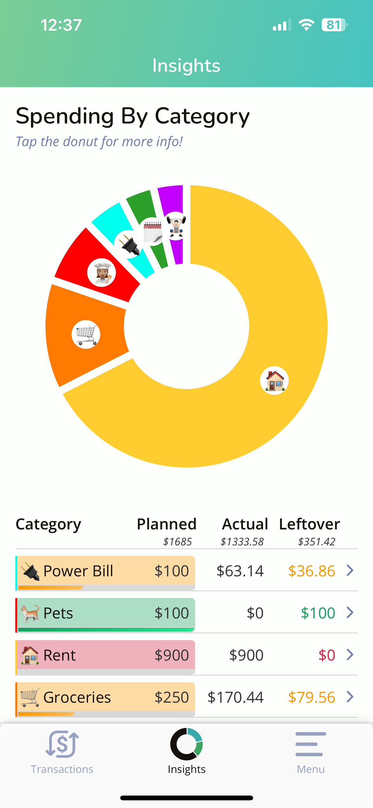
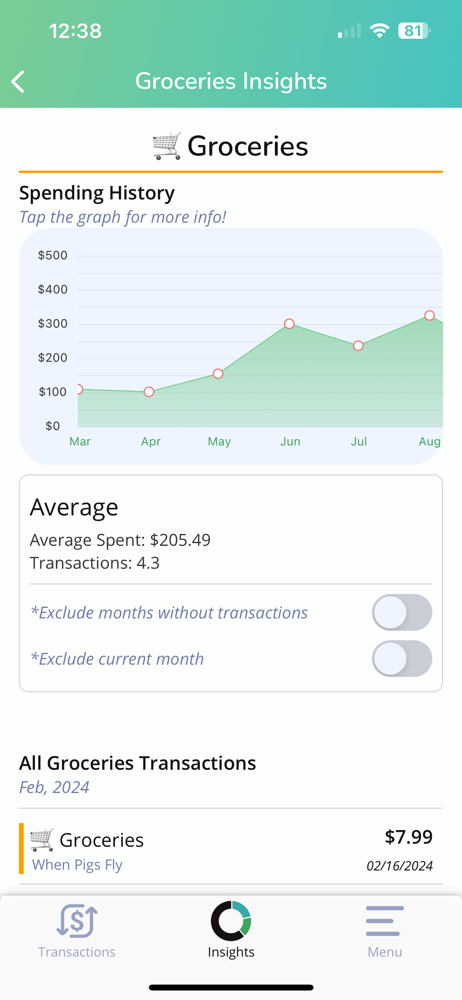
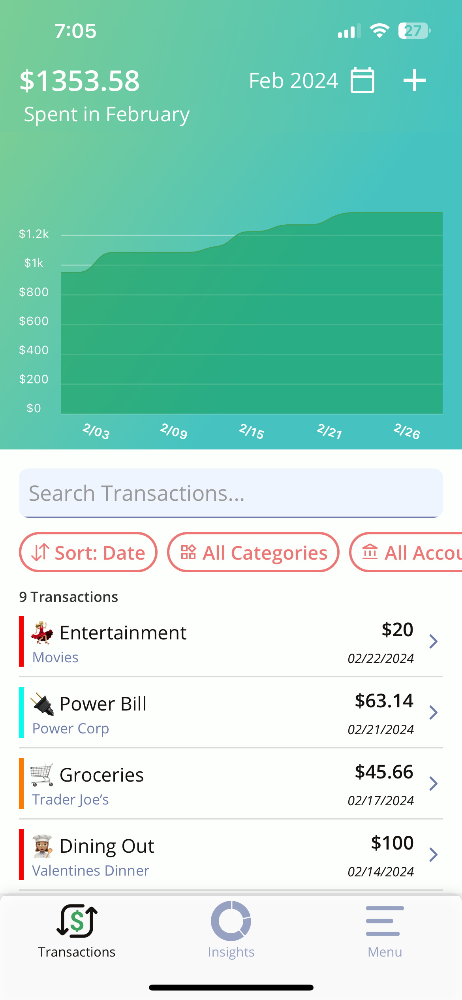

# What Makes Simple Budget a Good Budgeting App

## **What is Simple Budget?**

Simple Budget is a mobile budgeting app designed to help you take control of your finances. It’s hyper-focused on helping you budget proactively, without all the bells and whistles offered by other budgeting apps. The intentional simplicity and intuitive design of our app helps you dial in on spending less and saving more.

Everyone's budgeting journey is different, so Simple Budget is here to provide the flexibility required to assist your specific needs. With the Envelope Budgeting System, or Cash Stuffing, you designate specific expense categories - or your envelope - along with a predetermined amount to spend in each category. This method helps you organize and plan your expenses, laying the groundwork for consistent savings.

## Proactive Budgeting

A key aspect of Simple Budget is the act of manually logging your transactions. Other automated apps may offer the ease of automatically pulling your bank data, but they leave you susceptible to a "set it and forget it" mentality. These apps track your budget as you spend, whereas you should be aiming to let your budget guide your spending. (*Check out this article for a more detailed comparison of Simple Budget vs. Mint)*.

> ***Budgeting should be proactive, not retroactive.***

On the other hand, Simple Budget gives you the tools you need to start budgeting without doing it for you. This enables you to plan your spending ahead of time and fosters greater financial awareness. While it can get tedious at times, Simple Budget’s intuitive interface makes the process simpler and quicker.

### **Create a Tailored Budgeting Plan**

With our envelope-based budgeting system, getting started is easy. You begin by categorizing your expenses— these can be as vague as you like, but creating specific and meaningful categories will help you track your expenses more accurately. Don't be discouraged if it takes time to fine-tune the numbers, growing your finances is a long-term play. *For more on setting up your budget, check out our article on creating envelope categories for your budget.*

* Simple Budget provides category suggestions to help you get started
* Categories can each be edited anytime, even all at once to plan your budget on a more holistic level
* Simple Budget provides helpful insights, stats, and visualizations

### **Gain Insights Into Your Budget**

Simple Budget offers insights that empower you to save more and spend less. Dissect your spending patterns to uncover hidden trends and areas ripe with potential savings. Simple Budget helps you gain the power to make better-informed financial decisions, and with its customizable features and insightful analytics, will make sure you are headed in the direction you want to go.

### **Increase Your Savings**

Simple Budget is focused on helping you understand your expenses in a way that enables you to save more.

> Increasing your savings can happen one of two ways: start making more, or start spending less.

While making more money would be great, Simple Budget is here to help you spend less. Before working your way toward more savings, start with understanding your current expenses. Simple Budget will guide you through this while planning leftover income to put away. With a well-built budget, you have savings built in!

### Wrapping It Up

Simple Budget offers a powerful, hands-on solution for those seeking to take control of their finances and maximize their savings. It focuses on planning your expenses ahead of time and getting in front of your finances. It takes dedication and some effort, but pays off big time. Invest your time in your future, and download Simple Budget today.
